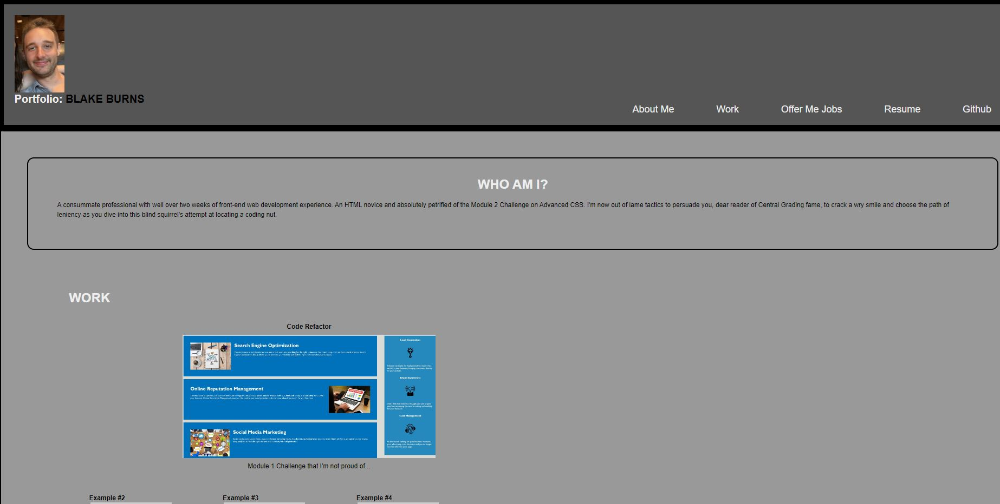

# professional-portfolio
Module 2 Challenge: Advanced CSS

## Live Link
https://blakerichardburns.github.io/professional-portfolio/

## Repository Link
https://github.com/blakerichardburns/professional-portfolio

## Description
Intended to test basic HTML and CSS skills, this is the first webpage the developer has built from scratch and deployed.

## Questions
For any inquiries, spam by inbox here: blakerichardburns@gmail.com  
To peruse more of my portfolio, check this out: [blakerichardburns](https://github.com/blakerichardburns)